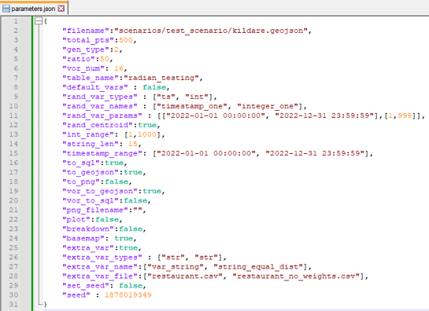

# __RADIAN - Synthetic Spatial Data Generation__

The **RADIAN** (RAnDom spatIal dAta geNerator) is a *Python*-based tool which endeavours to allow users, primarily in an educational setting, to produce "realistic", synthetic spatial datasets. RADIAN uses the `geopandas` and `random` Python packages in order to produce synthetic spatial datasets with an arbitrary number of additional metadata as needed, from random integers, to strings and timestamps. 

The initial iteration of RADIAN was created as a result of my thesis project as part of my MSc in Data Science & Analytics with Maynooth University, wherein it achieved a grade of a First-Class Honours (>70%).

Work on RADIAN is currently ongoing as part of my indiviudal project in the first year of my PhD  in the CRT Foundations of Data Science programme, again with Maynooth University.

## __Using RADIAN__

RADIAN is a tool built in Python and as such can be simply run from the command line. Points generation is controlled by a list of **parameters** stored in .JSON format which determines a wide range of factors such as the number of points to be generated, the type of generation to be used, among others. The only other pre-requisite of the software is a Polygon in the form of a .GeoJSON file within which RADIAN will generated the points dataset.

RADIAN (depending on the user parameters) will plot the resulting data via `matplotlib`, save the same plot as a .PNG image, and/or export the resulting points in GeoJSON and/or SQL format. Corresponding folders are produced in the same directory as the source polygon containing these exported files.

## __Development History__

This section will outline the primary work undertaken with RADIAN, first during my MSc and now during my PhD:

### __RADIAN 1.0 (MSc Project)__

The primary aim of the project that spawned RADIAN was to produce a tool in Python that would be used as part of the **CS621 Spatial Databases** module taught by Peter Mooney of Maynooth Supervisor, supervisor of this thesis and also lecturer for this module. In a classroom setting, having quick and easy access to datasets can be essential for teaching, both from the perspective of a lecturer/demonstrator trying to teach core concepts of working with spatial databases, as well as for the student in then practicing and developing their skills. 

The user would provide a polygon region (representing a real or arbitrary geographic region) in the form of a **GeoJSON** file. The RADIAN would then produce a set of points within the bounrd of this polygon region. The data generated by the tool needed to have the appearance of being realistic, however this is of course a difficult concept to exactly quantify. The main approach for acheiving "realism" was by producing points which were generated procedurally in a radial manner where points would concentrate towards the centroid of the given polygon region with density decreasing further away from said centroid.

The radial generation was achieved using concentric buffers of increasing size, that would be influenced by the overall shape of the original polygon, and would maintain an equal proportion of the total points to be generated. This equal proportion of points with a varying area results in the points naturally concentrating more towards the centre as a result of the concentric buffers overlapping. The RADIAN was also capable of multi-level generation, using Voronoi polygons to divide the original polygon into local sub-regions that would have points generated at a local level to mimic the behaviour of neighbourhoods in a city or counties/regions in a country.

By default RADIAN would assign a randomly generated integer, string, and timestamp value for each generated point, with users being able to optionally add additional variables sourced from a .CSV file consisting of a list of string/numeric values along with corresponding weights to determine their frequency of occurrence in the resulting dataset. RADIAN was also capable of exporting the final dataset in the form of a GeoJSON file format or SQL dump file for loading of the data onto a PostgreSQL server.

RADIAN was an easy to use tool, with data generation being controlled by a set of user-specified parameters in a .JSON file, that allowed for fast generation of datasets useful for a classroom setting. Areas that needed improving on lie primarily in the methods of data generation, as at larger polygon areas with large quantities of points, the underlying patterns for generation would be very much apparent, removing the feeling of the data appearing "realistic".

### __RADIAN 1.1 (PhD Individual Project: Weeks 1-3)__

After a semester of using the RADIAN tool in the CS621 lab setting, Peter was able to provide useful feedback for areas that RADIAN could be improved. The generation of extra variables was streamlined to allow for an arbitray number of variables to be generated (including none) as well as now allowing for multiple types of the same variable, rather than just one single int, string, and timestamp as in version 1.0.

Data exporting was also expanded upon, as the generated "local" Voronoi regions can now be exported in GeoJSON and SQL formats, just like the overall dataset of points.

This section is currently in progress, features such as a simple GUI interface for running the tool, as well as streamlining some of the code in general to improve performance.

### __RADIAN AI (PhD Individual Project: TBD)__
